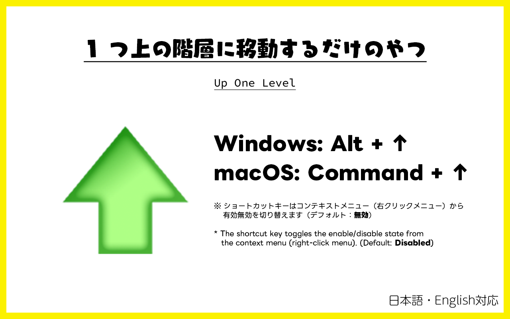

# 1 つ上の階層に移動するだけのやつ

Windows のエクスプローラーにある上へボタンのブラウザ版です。

[English version is here.](./README.md)

## Download

Google Chrome にインストールしてください。

## 使い方

2 通りの使い方があります。

- Google Chrome の拡張一覧からアイコンをクリックします
- ショートカットキーを入力します（Alt+↑ または Cmd ＋ ↑）
  - ショートカットキーはコンテキストメニュー（右クリックメニュー）から有効無効を切り替えます（**デフォルト：無効**）
