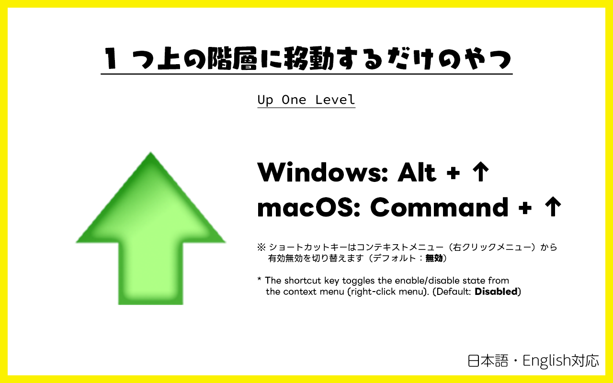

# The Up One Level Button for browser

 

The browser version of the 'Up One Level' button found in Windows Explorer.

[日本語はこちら](./README--ja.md)

## Download

Install it on your Google Chrome from here.

## How To Use

There are two ways to use it:

- Click the icon from the list of Google Chrome extensions.
- Input the shortcut key (Alt+↑ or Cmd+↑).
  - The shortcut key toggles the enable/disable state from the context menu (right-click menu). (**Default: Disabled**)
